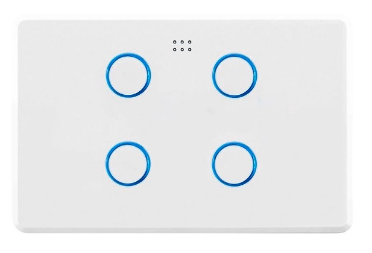

# Smart Light Switches

The aim was to replace my garage light switches with smart switches so that my dumb fluorescent garage lights could be turned on and off automatically - great for those late night arrivals home in the car.  Triggers in Home Assistant unclude upon detecting movement and opening the garage door.

This is an almost direct clone from https://www.esphome-devices.com/devices/DETA-Grid-Connect-Smart-Switch, and uses the DETA Grid Connect Smart Switches commonly found at Bunnings for relatively cheap: 
 - [1 Gang](https://www.bunnings.com.au/deta-grid-connect-smart-single-gang-touch-light-switch_p0098811)
 - [2 Gang](https://www.bunnings.com.au/deta-grid-connect-smart-double-gang-touch-light-switch_p0098812)
 - [3 Gang](https://www.bunnings.com.au/deta-grid-connect-smart-triple-gang-touch-light-switch_p0161014)
 - [4 Gang](https://www.bunnings.com.au/deta-grid-connect-smart-quad-gang-touch-light-switch_p0161015)

Extra guidance also came from: https://blog.mikejmcguire.com/2020/05/22/deta-grid-connect-3-and-4-gang-light-switches-and-home-assistant/ 

## Ingredients
 - wemos d1 mini
 - a DETA Grid Connect Smart Switch (I used the 4 gang one, even though there are only 3 gangs in my garage, I plan to use the 4th as a software switch to trigger things in Home Assistant.)
 - no breadboard required this time

Then [flashed](/README.md) the wemos with esphome, for the yaml, see [doorbell-sensor.yaml](/doorbell-sensor.yaml)

