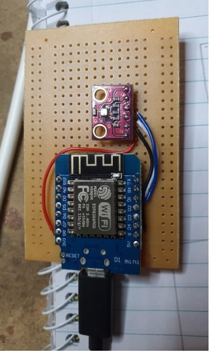

# Weather Station

Project to create a temperature, humidity and air pressure sensor using the BME280 sensor.  I originally tried the DHT11 and found it to be so inaccurate it was useless, I wouldn't bother buying one again.

# Ingredients: 
 - wemos d1 mini
 - BME280 sensor (many online places try to sell you the BMP280 sensor - be careful as the BMP280 sensor does not sense humidity). I bought a few of [these ones](https://www.ebay.com.au/itm/BME280-Digital-Sensor-I2C-SPI-Temperature-Humidity-Barometric-Pressure-Arduino-/333607830853?mkcid=16&mkevt=1&_trksid=p2349624.m46890.l49286&mkrid=705-154756-20017-0).
  - small breadboard (protoboard), I used [this one](https://www.jaycar.com.au/small-breadboard-layout-prototyping-board/p/HP9570?gclid=Cj0KCQjw0umSBhDrARIsAH7FCodqYenrylYihAnwdhDvVWKaHqEdv6Fcirz59BYOIwHFLGXBcQuaj2caAkRPEALw_wcB)

# Wiring it up: 

| BME pin | wemos d1 mini pin|
|--|--|
| VCC | 3.3V |
| GND | GND |
| SCL | SCL (D1) |
| SDA | SDA (D2) |

With a simple diagram as follows: 

After I breadboarded it for a bit, I then soldered it together: 

# Flashing with esphome

See the instructions on the [main page](/README.md) on how to flash.  Use the [weather-sensor.yaml](/weather-sensor.yaml) file for this.

You can then add the device into Home Assistant, which the moment I said I had a new Esphome device, Home Assistant had already found it and I only had to enter in a password.
